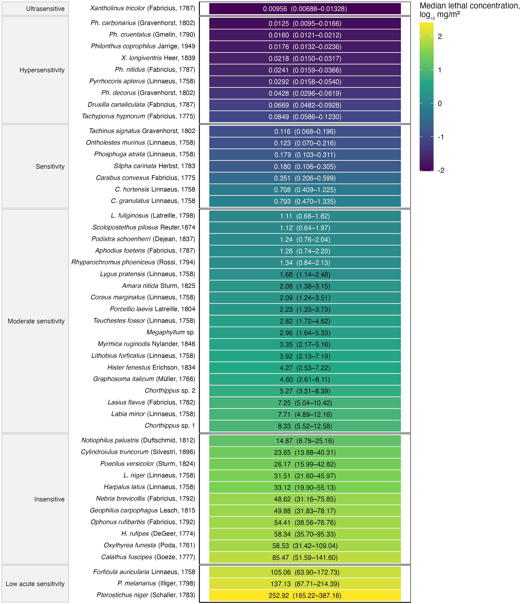
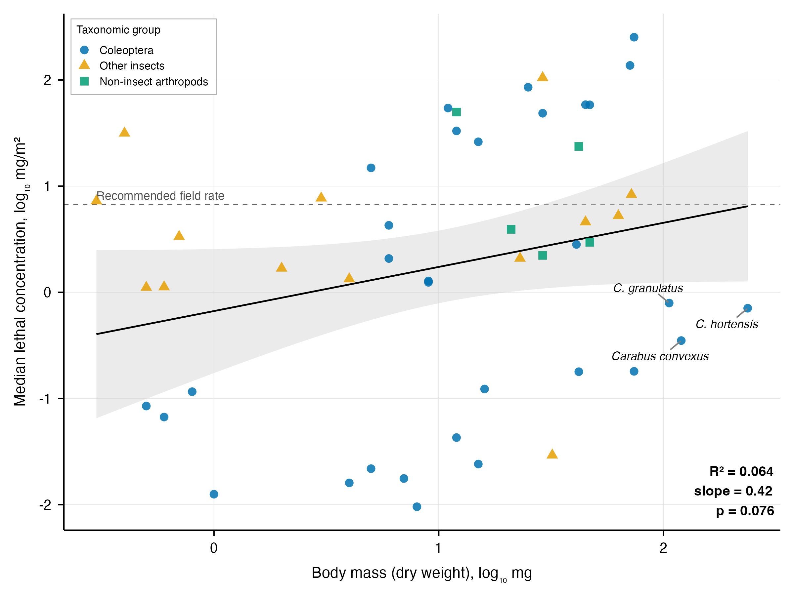
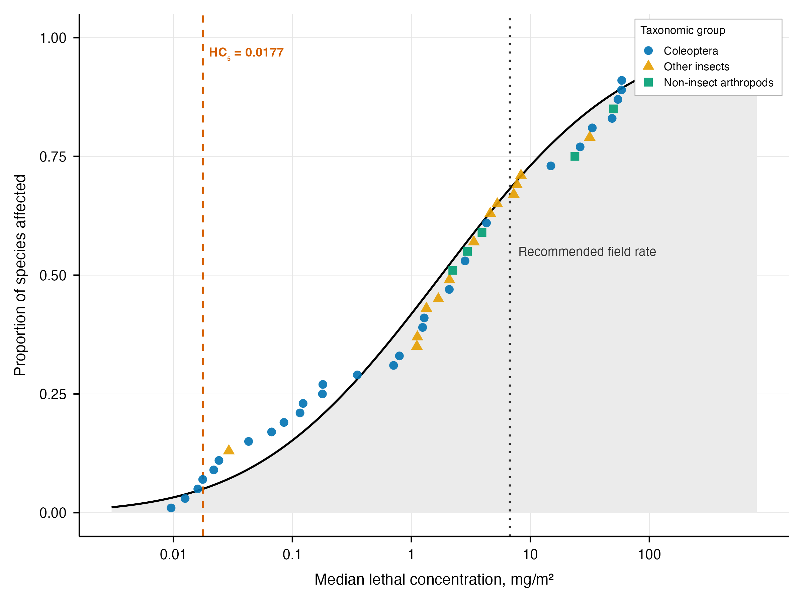
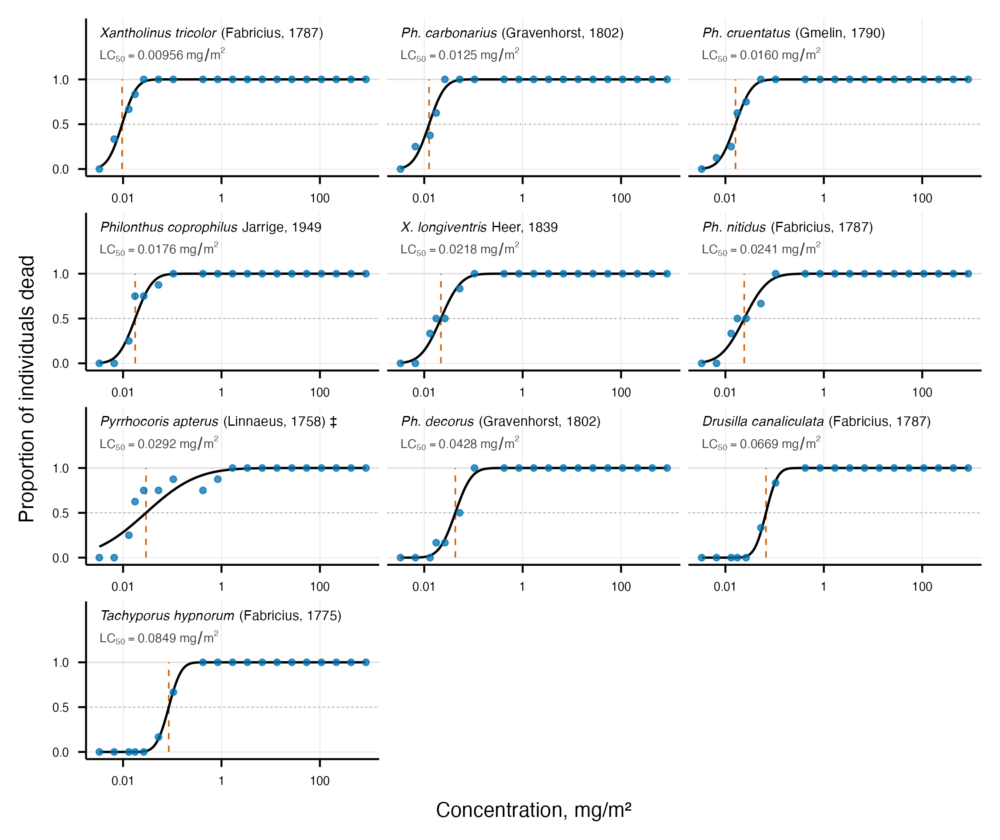
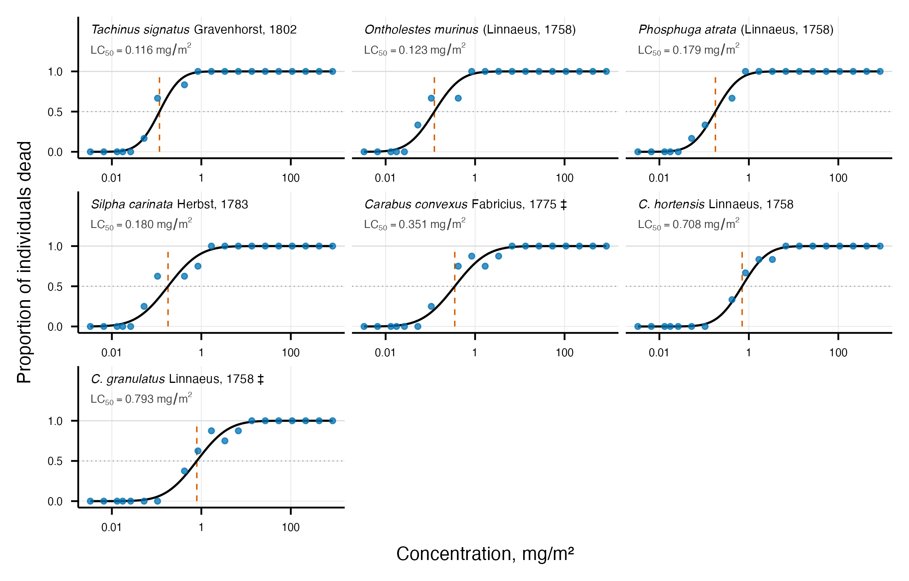
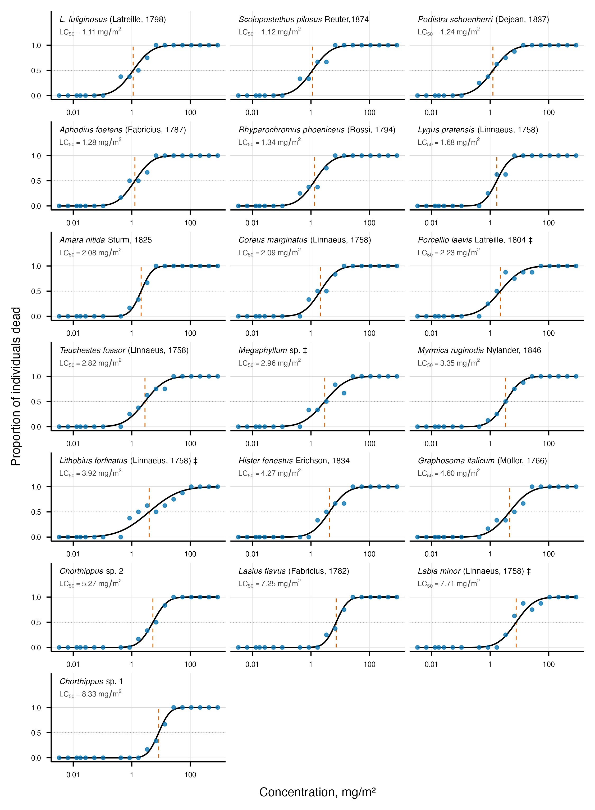
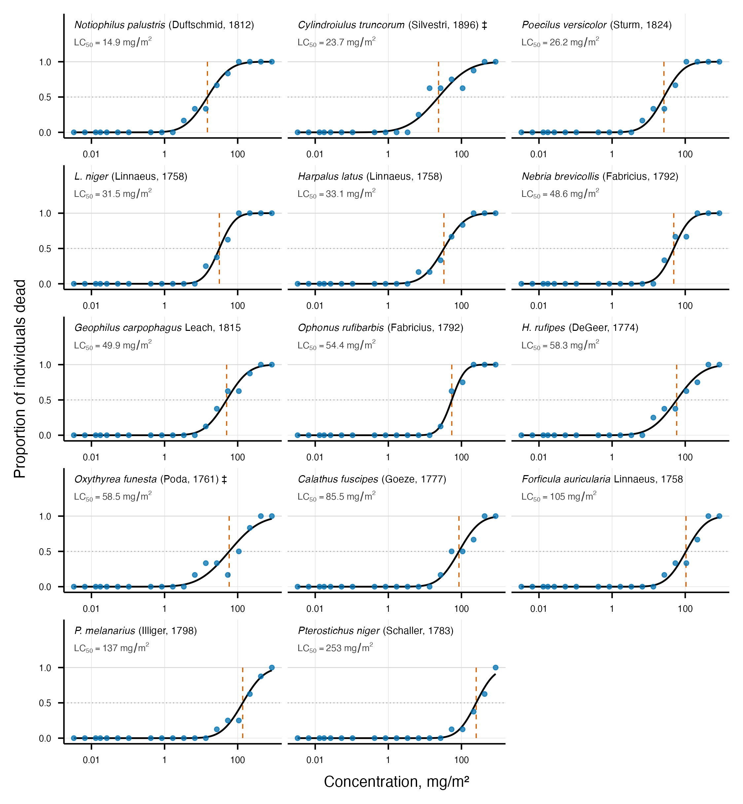

# Sensitivity of nontarget terrestrial arthropods to thiacloprid

## Abstract

Neonicotinoids act on the nicotinic acetylcholine receptors of insects and affect a broad range of nontarget invertebrates. Under laboratory conditions we assessed the sensitivity of 50 species of terrestrial arthropods to a commercial thiacloprid formulation (Biscaya 240 OD, expressed as thiacloprid active ingredient), applied to the surface of exposure containers at 19 concentrations, with mortality scored after 24 h. Median lethal concentrations were estimated for each species by binomial probit regression on log~10~ dose and are reported with 95% confidence intervals. Sensitivity spanned four orders of magnitude, from 0.00956 mg/m² for the rove beetle *Xantholinus tricolor* (Fabricius, 1787) to 253 mg/m² for the ground beetle *Pterostichus niger* (Schaller, 1783). Rove beetles were the most sensitive family, with median lethal concentrations below those of the remaining species (Welch t = -11.80, df = 38.4, p = 2.41 × 10⁻¹⁴). Sensitivity was unrelated to trophic specialization (F = 0.05, df = 3, 43, p = 0.984) and to taxonomic group (F = 0.94, df = 2, 43, p = 0.400). Larger species tolerated higher doses, a relationship resolved only when species were weighted by the precision of their own estimate (F = 8.37, df = 1, 43, p = 0.006); the three *Carabus* species were more sensitive than their body mass predicts (Welch t = -4.93, df = 20.1, p = 7.89 × 10⁻⁵). A species sensitivity distribution fitted to the 50 estimates placed the concentration protecting 95% of species at 0.0177 mg/m², which the dose recommended for agrocenoses exceeds by a factor of 380. Of the 50 species, 33 had a median lethal concentration below that recommended dose. These results describe acute mortality over 24 h after a single surface exposure and do not address sublethal, chronic or dietary effects.

## Citation

Faly, L. I., Brygadyrenko, V. V., Orzekauskaitė, A., Paulauskas, A., & Rybalka, D. (2026). Sensitivity of nontarget terrestrial arthropods to thiacloprid \[Raw data\]. Oles Honchar Dnipro National University. https://doi.org/10.15421/5126103

## Data

**Table1_mortality_by_concentration.csv** — the raw data. Living and dead counts for each of the 50 species at each of the 19 thiacloprid concentrations, from 0.0033 to 860.16 mg/m². Two rows per species, one for living and one for dead individuals, 6,612 individuals in total. Every value reported in the manuscript derives from this file.

**Table2_LC50_refitted_with_diagnostics.csv** — the median lethal concentrations as reported in the manuscript, refitted from the counts above by binomial probit regression on log₁₀ dose. Carries the LC₅₀, its 95% confidence interval, the slope with its standard error, the intercept, the Pearson χ² goodness-of-fit statistic and its degrees of freedom, mean dry body mass (mg) and body length (mm).

**Table3_sensitivity_classes_refitted.csv** — the species assigned to sensitivity classes by the refitted LC₅₀, one row per species, with order, family, trophic specialization and a flag for the species whose confidence interval crosses a class boundary.

**Table2_LC50_by_species.csv** — the median lethal concentrations as originally published (LC₅₀, mean ± SE), retained for comparison with the refitted values.

**Table3_sensitivity_groups.csv** — the sensitivity classes as originally published. Where a cell held several stacked entries in the original table, they are separated by semicolons, and the columns align position by position.

## Results

Figure 1. Median lethal concentration of a thiacloprid formulation for 50 species of nontarget terrestrial arthropods after 24 h of exposure, with the 95% confidence interval printed in each tile and the species grouped into six sensitivity classes.

Figure 2. Relationship between mean dry body mass and median lethal concentration across the 50 species, with the three *Carabus* species labelled and the regression statistics printed on the plot.

Figure 3. Species sensitivity distribution fitted to the 50 median lethal concentrations, marking the concentration protecting 95% of species and the dose recommended for agrocenoses.

Figure 4. Fitted dose-response curves against the observed counts for the ten species of the ultrasensitive and hypersensitive classes.

Figure 5. Fitted dose-response curves for the seven species of the sensitive class; panel layout and symbols as in Figure 4.

Figure 6. Fitted dose-response curves for the 19 species of the moderately sensitive class; panel layout and symbols as in Figure 4.

Figure 7. Fitted dose-response curves for the 14 species of the insensitive and low acute sensitivity classes; panel layout and symbols as in Figure 4.

#### Keywords:

terrestrial invertebrates; epigean arthropods; nontarget species; neonicotinoids; thiacloprid; susceptibility to insecticides; median lethal concentration.

#### Contributors:

L. I. Faly, Vytautas Magnus University, Kaunas, Lithuania

V. V. Brygadyrenko, Oles Honchar Dnipro National University, Dnipro, Ukraine; Dnipro State Agrarian and Economic University, Dnipro, Ukraine

E-Mail: brigad@ua.fm

A. Orzekauskaitė, Vytautas Magnus University, Kaunas, Lithuania

A. Paulauskas, Vytautas Magnus University, Kaunas, Lithuania

Research and development, data visualization and aggregation:

Denis Rybalka

E-Mail: denisrybalka89@gmail.com
